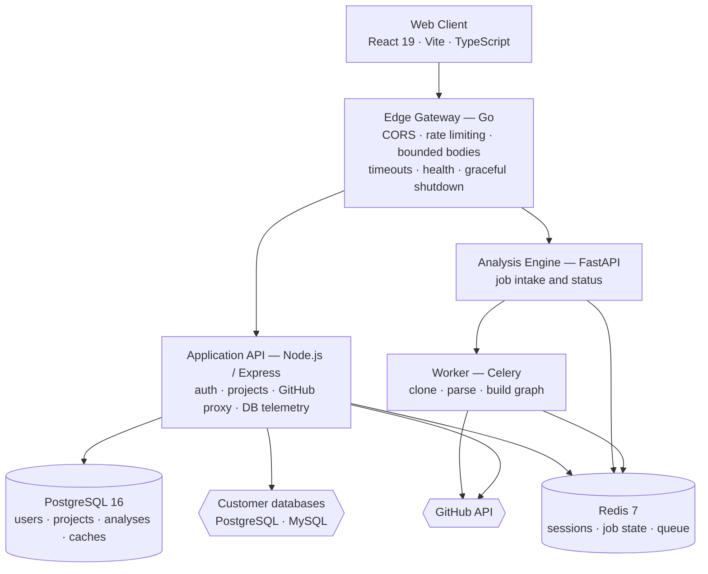

<div align="center">

# GraphKeep

### Turn any repository into an explorable engineering workspace

Architecture graphs, Git intelligence, database visualization, and security analysis — unified in a single workspace built for engineers who need to understand a codebase, not just read it.

[](#license)
[](https://react.dev)
[](https://www.typescriptlang.org)
[](https://go.dev)
[](https://fastapi.tiangolo.com)
[](https://www.postgresql.org)
[](https://docs.docker.com/compose/)

</div>

---

## Table of Contents

- [Overview](#overview)
- [Capabilities](#capabilities)
- [Database Visualizer](#database-visualizer-1)
- [System Architecture](#system-architecture)
- [Technology Stack](#technology-stack)
- [Getting Started](#getting-started)
- [Running with Docker](#running-with-docker)
- [Configuration](#configuration)
- [API Reference](#api-reference)
- [Application Routes](#application-routes)
- [Project Structure](#project-structure)
- [Testing](#testing)
- [Contributing](#contributing)
- [License](#license)

---

## Overview

**GraphKeep** is a full-stack platform for software engineers and engineering leads who need to make sense of an unfamiliar or rapidly changing codebase.

You connect a GitHub account, select a repository, and GraphKeep builds a persistent workspace around it: a navigable architecture graph, a file-level dependency explorer, contributor and ownership history, database schema visualization, and a security and quality assessment — all backed by an asynchronous analysis pipeline that keeps large repositories responsive.

### Design Principles

| Principle | What it means in practice |
|-----------|---------------------------|
| **Structure at a glance** | The architecture graph is the primary surface, not a secondary report. |
| **Evidence stays close** | Drill-down actions sit next to the data they explain. |
| **Risk without noise** | Security and churn signals are surfaced without obscuring primary work. |
| **Precision over metaphor** | Stable, dense, technical interfaces instead of decorative abstractions. |

---

## Capabilities

The workspace is organized into modules, each addressing a distinct question about the codebase.

### Overview
Repository health, aggregate risk indicators, and prioritized next steps in a single summary.

### Explore
An interactive code graph of files and their dependencies, navigable, filterable, and grouped by folder and architectural layer, with drill-down into individual files. Three graph modes answer different questions about the same data:

| Mode | Layout | Best for |
|------|--------|----------|
| **Tree** | Radial cluster of the nested folder hierarchy | Orienting inside an unfamiliar folder structure |
| **Bundle** | Circular edge bundling around folder-grouped files | Reading cross-cutting dependencies at a glance |
| **Code** | Force-directed file graph with real source opened as floating, syntax-highlighted cards anchored to each node | Reading the actual implementation without leaving the graph |

A repository can be loaded from a GitHub URL, a local folder, or a `.zip` archive, with custom exclude patterns applied before analysis and a dedicated flow for assessing an open pull request's blast radius.

### Insights — History & Ownership
| Tool | Purpose |
|------|---------|
| **Branches** | Compare development lines and inspect divergence |
| **Commits** | Repository activity over time |
| **People** | Contributor distribution and engagement |
| **Ownership** | Per-file ownership derived from commit history |
| **Releases** | Generate structured release notes |
| **PR Review** | Assess the risk and blast radius of proposed changes |

### Architecture
A grouped, layered view of modules and their dependencies. When an OpenAI key is configured, the validated graph can be enriched with generated explanations — the topology itself is never modified, and every identifier is preserved and re-validated server-side.

### Security
Dependency and code-level vulnerability analysis surfaced directly against the affected files.

### Patterns
Detection of recurring design patterns and anti-patterns across the codebase.

### Quality
| Tool | Purpose |
|------|---------|
| **Tech Debt** | Maintenance hotspots ranked by cost |
| **Stale Code** | Aging-code radar for unmaintained regions |
| **Trends** | Health metrics tracked over time |
| **Migrations** | Schema migration tracking |

### Database Visualizer
A dedicated surface for connected databases — schema exploration, ER diagrams, and live operational telemetry for PostgreSQL and MySQL. See [Database Visualizer](#database-visualizer-1) for the full description.

### Collaboration
Workspaces group related projects; projects carry members, connected repositories, database credentials, and stored analysis results. Credentials are encrypted at rest.

---

## Database Visualizer

The Database Visualizer is a standalone module at `/db`, separate from the repository workspace. It answers a different question: not *how is this code structured*, but *what shape is the data, and how is the database behaving right now*.

It operates in two modes. **Schema mode** works from a schema alone and needs no live connection. **Telemetry mode** attaches to a project's stored credentials and streams operational metrics from a running instance.

### Schema Sources

A schema can be assembled from three independent paths, which can be combined:

| Source | Mechanism | Endpoint |
|--------|-----------|----------|
| **Live introspection** | The server connects to the instance and reads its catalog — tables, columns, types, nullability, primary keys, foreign keys, indexes, row estimates, and on-disk size. | `POST /api/db/connect/postgres`<br/>`POST /api/db/connect/mysql` |
| **Raw SQL** | `CREATE TABLE` statements are parsed server-side into tables, columns, primary keys, and foreign-key constraints. | `POST /api/db/parse-sql` |
| **Source code** | Repository files are scanned in the browser and schema definitions are recovered from ORM models. | — |

#### Supported ORM and Schema Formats

Code-derived schemas are detected by file extension and content signature, then parsed into a common table-and-relation model:

| Format | Detection | Extracted |
|--------|-----------|-----------|
| **SQL DDL** | `.sql`, or any `CREATE TABLE` statement | Tables, columns, types, primary keys, foreign keys |
| **Django** | `models.Model` subclasses, or `models.*Field` usage | Models, fields, `ForeignKey` / `OneToOneField` / `ManyToManyField` relations, `Meta.db_table` overrides, and the owning app label |
| **SQLAlchemy** | `Column(...)` or `mapped_column(...)` inside a class | Models, columns, and declared types |
| **Prisma** | `.prisma`, or a `datasource db` block | Models, fields, and relations |

Relations carry cardinality (`one-to-one`, `one-to-many`, `many-to-one`, `many-to-many`), and every table retains its originating file and line number, so a node on the diagram can be traced back to the code that defines it. When a repository mixes formats — Django models alongside raw migrations, for example — the schema is tagged `mixed` and tables are deduplicated by name.

### ER Diagram Rendering

The diagram is built with **React Flow**. Each table is a custom node whose columns are individually addressable, with dedicated connection handles per column so a foreign key attaches to the exact field it references rather than to the table as a whole. Primary keys, foreign keys, unique columns, and nullability are marked inline.

Layout adapts to graph size:

- **Layered layout** for smaller schemas — tables are assigned to columns by dependency depth, then refined with a barycenter sweep (a Sugiyama-style pass) that reorders nodes within each layer to reduce edge crossings. This produces a readable left-to-right dependency flow.
- **Force-directed layout** above a node threshold — a D3 force simulation (charge, link, centering, collision, and axial forces) takes over, since layered ordering stops being legible on large schemas.

Rendering is windowed to visible elements only, and the canvas provides zoom, pan, a minimap, and fit-to-view.

### Schema Exploration

Beyond the diagram itself, the schema surface includes a **domain map** for grouping related tables, a **table map**, a searchable **schema explorer**, an **objects panel**, and a **detail drawer** for inspecting a single table's columns, keys, indexes, and relationships.

### Operational Telemetry

When a project has stored database credentials, nine dashboards read live state from the instance:

| Dashboard | Contents |
|-----------|----------|
| **Overview** | Health score and status, instance identity and uptime, connection breakdown (active / idle / waiting / max), operations per second, database size, throughput series, an eight-category health matrix, recent activity, top queries, 7-day storage growth, and active alerts |
| **Performance** | Latency percentiles (p50 / p95 / p99), operations per second, connection state including blocked sessions, read/write/transaction throughput, and engine-specific intelligence metrics |
| **Queries** | Top statements by total execution time — normalized fingerprint, call count, average and p95 duration, total time, rows returned, and a derived impact rating |
| **Schema** | The ER diagram and schema explorer described above |
| **Storage** | Database size, 7-day growth in bytes and percent, total index size, largest object, a historical size series, and per-table data / index / total byte breakdown |
| **Replication** | Topology mode (standalone, primary, or replica), replica list, per-replica state, and lag |
| **Activity** | A live event stream — slow queries, connection open/close, lock detection, deadlocks, and schema changes |
| **Security** | A security score, user and role inventory with granted privileges, count of privileged accounts, and graded findings |
| **Alerts** | Alert rule management and currently firing alerts |

The eight health-matrix categories are connections, latency, queries, locks, replication, storage, cache, and errors — each reported as `healthy`, `warning`, `critical`, or `unknown`.

#### Data Sources

Metrics are read directly from each engine's own instrumentation. Nothing is installed into the target database.

| Engine | System views and commands |
|--------|---------------------------|
| **PostgreSQL** | `pg_stat_activity`, `pg_stat_database`, `pg_stat_statements`, `pg_stat_replication`, `pg_stat_user_tables`, `pg_locks`, `pg_roles`, `pg_database_size()`, `pg_total_relation_size()`, `pg_relation_size()`, `pg_is_in_recovery()`, `pg_postmaster_start_time()` |
| **MySQL** | `SHOW GLOBAL STATUS`, `SHOW PROCESSLIST`, `SHOW VARIABLES`, `SHOW REPLICA STATUS` (falling back to `SHOW SLAVE STATUS`), `information_schema.TABLES`, `performance_schema.events_statements_summary_by_digest` |

**Graceful degradation.** Capabilities that depend on optional instrumentation are detected rather than assumed. If `pg_stat_statements` is not enabled, the query and latency panels return an explicit `available: false` with a readable explanation instead of failing the request — the rest of the dashboard continues to function. Where an engine exposes only aggregate statistics, derived percentiles are labeled as such rather than presented as exact measurements.

**Rate derivation.** Engines expose monotonic counters, not rates. Per-second figures are computed from the delta between consecutive polls, held in a short-lived server-side cache alongside a rolling buffer of recent activity events.

### Historical Snapshots

Selected metrics — database size, table count, and active and total connections — are periodically written to `db_metric_snapshots` in the platform's own PostgreSQL database. This is what makes 7-day growth figures, size history, and trend charts possible: the source engine does not retain that history itself.

### Alert Rules

Alert rules are stored per project and evaluated on each telemetry refresh against currently computed metric values.

| Field | Description |
|-------|-------------|
| `metric` | The metric key to watch, for example `p95_latency_ms` or `connections_pct` |
| `condition` | `gt` (greater than) or `lt` (less than) |
| `threshold` | The numeric boundary |
| `forMinutes` | Duration the condition must hold, defaulting to 5 |
| `enabled` | Whether the rule is evaluated |

Severity is derived from how far the current value has moved past the threshold: beyond **2×** is `critical`, beyond **1.3×** is `high`, and anything else is a `warning`. Firing alerts surface on the Overview and Performance dashboards as well as the Alerts page.

### Credential Handling

Database credentials attached to a project are encrypted at rest using `DB_CREDENTIALS_SECRET`, which the API refuses to leave at its development default in production. Connections support SSL and are opened with bounded timeouts, then closed after each request — including on the error path.

---

## System Architecture

GraphKeep is a four-tier system: a React client, a Go edge gateway, a Node.js application API, and a Python analysis engine, backed by PostgreSQL and Redis.



### Request Flow

1. The client sends every request to the **Go gateway**, the single public entry point.
2. The gateway routes `/api/analyze` and `/api/tasks/{id}` to the **FastAPI engine**, and all authentication, project, database, and GitHub routes to the **Node API**.
3. Analysis jobs are queued to **Celery**; the worker clones the repository, builds the dependency graph, and writes progress and results to **Redis**.
4. The client polls task status until the graph is ready, then renders it in the workspace.
5. Completed analyses and repository trees are cached in **PostgreSQL**, so repeat visits avoid both re-analysis and GitHub rate limits.

### Notes on the Gateway

`server-go/` is built on the Go standard library only — no third-party dependencies. It provides bounded request bodies (10 MB), upstream timeouts, per-client rate limiting, a concurrency ceiling, structured logging, panic recovery, explicit CORS, liveness and readiness probes, and graceful shutdown.

The Node API remains the compatibility implementation for OAuth and database routes until those are migrated and parity-tested behind the gateway.

### Notes on Caching

The GitHub proxy caches repository trees and file blobs in PostgreSQL. A fresh cache row is served with zero network calls; a stale row is revalidated with a conditional `ETag` request, which costs nothing against the GitHub rate limit when the API replies `304 Not Modified`.

---

## Technology Stack

| Layer | Technologies |
|-------|--------------|
| **Client** | React 19, TypeScript, Vite, React Router 7, Tailwind CSS 4, Framer Motion |
| **Visualization** | Sigma.js + Graphology, React Flow (`@xyflow/react`), D3 (incl. `d3-sankey`), Mermaid with ELK layout |
| **Gateway** | Go 1.23+ (standard library only) |
| **Application API** | Node.js, Express 5, Passport (GitHub OAuth 2.0 + local), Helmet, express-rate-limit, BullMQ |
| **Analysis Engine** | Python, FastAPI, Celery, GitPython, Graphify |
| **Parsing** | Tree-sitter (WASM), Acorn, `sqlparse` |
| **Data** | PostgreSQL 16, Redis 7.4 |
| **Connectors** | PostgreSQL (`pg`), MySQL (`mysql2`) |
| **Infrastructure** | Docker Compose, Nginx, CodeQL |

---

## Getting Started

### Prerequisites

| Requirement | Version | Required for |
|-------------|---------|--------------|
| Node.js | 24 | Client and application API (Docker images use `node:24-alpine`) |
| Python | 3.12 | Analysis engine and worker (Docker image uses `python:3.12-slim`) |
| Go | 1.23+ | Edge gateway (optional in development) |
| PostgreSQL | 16 | Persistent storage |
| Redis | 7+ | Sessions, job state, and queue |
| Docker | Compose v2 | Containerized setup (recommended) |

### 1. Clone the repository

```bash
git clone https://github.com/RAMAN0330/CodeGraph.git
cd CodeGraph
```

### 2. Install dependencies

```bash
npm run install:all      # Root, server, and client Node packages
npm run install:python   # Python dependencies for the analysis engine
```

### 3. Configure the environment

Create `server/.env` from the reference in [Configuration](#configuration), then point the client at the API:

```bash
cp client/.env.example client/.env
```

### 4. Register a GitHub OAuth application

Create an OAuth app at **GitHub → Settings → Developer settings → OAuth Apps** and set the callback URL to match `GITHUB_CALLBACK_URL`. For local development:

```
http://localhost:5000/auth/github/callback
```

Copy the resulting client ID and secret into `server/.env`.

### 5. Start the development stack

```bash
npm run dev
```

This runs the Node API, the Vite client, the FastAPI engine, and the Celery worker concurrently.

To develop against the Go gateway — which is how production is served — use:

```bash
npm run dev:go
```

The gateway then occupies port `5000` and the Node API moves to `5001`.

### Development Ports

| Service | Port (`npm run dev`) | Port (`npm run dev:go`) |
|---------|----------------------|-------------------------|
| Web client (Vite) | `5173` | `5173` |
| Go gateway | — | `5000` |
| Node application API | `5000` | `5001` |
| FastAPI analysis engine | `8000` | `8000` |

### Available Scripts

| Command | Description |
|---------|-------------|
| `npm run dev` | Node API, client, FastAPI, and Celery worker |
| `npm run dev:node` | Node API and client only |
| `npm run dev:go` | Full stack behind the Go gateway |
| `npm run build` | Production build of the client and Node API |
| `npm run build:go` | Compile the gateway to `server-go/bin/codeflow-api` |
| `npm run install:all` | Install all Node dependencies |
| `npm run install:python` | Install Python dependencies |

---

## Running with Docker

The Compose stack builds and runs every service, including PostgreSQL and Redis.

```bash
npm run docker:up      # Build and start the full stack
npm run docker:down    # Stop and remove the stack
```

The application is served at **http://localhost:8080**.

`POSTGRES_PASSWORD` is mandatory and has no default — Compose fails fast if it is unset. Port `5001` is also mapped through Nginx so that a GitHub OAuth callback registered against `localhost:5001` continues to resolve.

| Service | Role |
|---------|------|
| `client` | Nginx serving the built React application |
| `gateway` | Go edge gateway, the public entry point |
| `legacy-api` | Node application API |
| `analysis` | FastAPI analysis engine |
| `worker` | Celery worker |
| `postgres` | PostgreSQL 16 with a persistent volume |
| `redis` | Redis 7.4 with AOF persistence and an LRU memory ceiling |

---

## Configuration

### Application API — `server/.env`

| Variable | Default | Description |
|----------|---------|-------------|
| `NODE_ENV` | `development` | Runtime mode. Production enforces the checks below. |
| `PORT` | `5000` | API listening port |
| `CLIENT_ORIGIN` | `http://localhost:5173` | Allowed CORS origin |
| `FASTAPI_URL` | `http://localhost:8000` | Analysis engine base URL |
| `DATABASE_URL` | — | PostgreSQL connection string. **Required in production.** |
| `REDIS_URL` | — | Redis connection string. **Required in production.** |
| `SESSION_SECRET` | `dev-secret-change-me` | Session signing secret. **Must be changed in production.** |
| `DB_CREDENTIALS_SECRET` | `dev-secret-change-me` | Encryption key for stored database credentials. **Must be changed in production.** |
| `GITHUB_CLIENT_ID` | — | GitHub OAuth application ID |
| `GITHUB_CLIENT_SECRET` | — | GitHub OAuth application secret |
| `GITHUB_CALLBACK_URL` | `http://localhost:5000/auth/github/callback` | OAuth redirect target |
| `OPENAI_API_KEY` | — | Optional. Enables architecture explanations. |
| `OPENAI_MODEL` | `gpt-5-mini` | Model used for enrichment |
| `REPO_CACHE_TTL_MS` | `21600000` | Repository cache lifetime (6 hours) |

> **Production safeguard:** the API refuses to start if `SESSION_SECRET` or `DB_CREDENTIALS_SECRET` still hold their development defaults, or if `DATABASE_URL` or `REDIS_URL` is missing.

### Edge Gateway — `server-go/`

| Variable | Default | Description |
|----------|---------|-------------|
| `PORT` | `5000` | Gateway listening port |
| `CLIENT_ORIGIN` | `http://localhost:5173` | Allowed CORS origin. A wildcard `*` is rejected. |
| `FASTAPI_URL` | `http://localhost:8000` | Analysis engine upstream |
| `LEGACY_API_URL` | `http://localhost:5001` | Node API upstream |
| `RATE_LIMIT_RPS` | `50` | Requests per second per client |
| `MAX_CONCURRENT_REQUESTS` | `256` | Concurrency ceiling |

### Client — `client/.env`

| Variable | Default | Description |
|----------|---------|-------------|
| `VITE_API_URL` | `http://localhost:5000` | Backend base URL |

### Docker Compose

| Variable | Default | Description |
|----------|---------|-------------|
| `POSTGRES_USER` | `codegraph` | Database user |
| `POSTGRES_PASSWORD` | — | **Required.** No default. |
| `POSTGRES_DB` | `codegraph` | Database name |
| `CELERY_CONCURRENCY` | `2` | Worker process count |

---

## API Reference

### Health

| Method | Endpoint | Description |
|--------|----------|-------------|
| `GET` | `/health/live` | Liveness probe |
| `GET` | `/health/ready` | Readiness probe, including upstream checks |

### Authentication

| Method | Endpoint | Description |
|--------|----------|-------------|
| `GET` | `/auth/config` | Reports whether GitHub OAuth is enabled |
| `POST` | `/auth/register` | Register with username and password |
| `POST` | `/auth/login` | Authenticate with credentials |
| `GET` | `/auth/github` | Begin the GitHub OAuth flow |
| `GET` | `/auth/github/callback` | OAuth callback |
| `POST` | `/auth/github/disconnect` | Unlink the GitHub account |
| `GET` | `/auth/me` | Current session identity |
| `POST` | `/auth/logout` | End the session |

> Credential routes are rate limited independently of general API traffic.

### Analysis

| Method | Endpoint | Description |
|--------|----------|-------------|
| `POST` | `/api/analyze` | Queue a repository analysis job |
| `GET` | `/api/tasks/{taskId}` | Poll job status and progress |
| `GET` | `/api/analysis/{owner}/{repo}` | Retrieve a stored analysis |
| `POST` | `/api/analysis/{owner}/{repo}/refresh` | Force re-analysis |
| `POST` | `/api/architecture/enrich` | Generate architecture explanations |

### GitHub

| Method | Endpoint | Description |
|--------|----------|-------------|
| `POST` | `/api/github/repo` | Fetch a repository tree (cached, ETag-revalidated) |
| `POST` | `/api/github/file` | Fetch file contents |
| `GET` | `/api/github/repos` | List repositories for the signed-in user |
| `GET` | `/api/github/token` | Retrieve the session's GitHub token |

### Workspaces & Projects

| Method | Endpoint | Description |
|--------|----------|-------------|
| `GET` | `/api/projects` | List accessible projects |
| `POST` | `/api/workspaces` | Create a workspace |
| `DELETE` | `/api/workspaces/{id}` | Delete a workspace |
| `POST` | `/api/projects` | Create a project |
| `DELETE` | `/api/projects/{id}` | Delete a project |
| `POST` | `/api/projects/{id}/members` | Add a member |
| `DELETE` | `/api/projects/{id}/members/{memberId}` | Remove a member |

### Databases

| Method | Endpoint | Description |
|--------|----------|-------------|
| `POST` | `/api/db/connect/postgres` | Introspect a PostgreSQL schema |
| `POST` | `/api/db/connect/mysql` | Introspect a MySQL schema |
| `POST` | `/api/db/parse-sql` | Derive a schema from raw SQL |
| `POST` | `/api/projects/{id}/schema` | Store a project schema |
| `PUT` | `/api/projects/{id}/db-connection` | Store encrypted connection credentials |

### Database Telemetry

All endpoints are scoped to a project: `/api/projects/{id}/db/*`

| Endpoint | Description |
|----------|-------------|
| `/overview` | Connection and instance summary |
| `/performance` | Throughput and latency indicators |
| `/queries` | Query-level statistics |
| `/storage` | Table and index storage growth |
| `/replication` | Replication state and lag |
| `/activity` | Live session activity |
| `/security` | Roles, privileges, and exposure checks |
| `/alerts` | List, create (`POST`), and delete (`DELETE /alerts/{ruleId}`) alert rules |

---

## Application Routes

| Route | Description |
|-------|-------------|
| `/` | Landing page |
| `/login` · `/register` · `/welcome` | Authentication and onboarding |
| `/workspaces` | Workspace directory |
| `/workspaces/:workspaceId/projects` | Projects within a workspace |
| `/select-repo` | Repository selection |
| `/workspace` | Main analysis workspace |
| `/db` | Database visualizer |

All routes are lazy-loaded, keeping feature bundles isolated until navigation.

---

## Project Structure

```
CodeGraph/
├── client/                      # React 19 + Vite web application
│   └── src/
│       ├── app/                 # Runtime configuration and composition
│       ├── features/
│       │   ├── analysis/        # Parsing, metrics, technical-debt analysis
│       │   ├── auth/            # Login, registration, onboarding
│       │   ├── database/        # Schema ingestion and ER visualization
│       │   ├── export/          # Report and graph exports
│       │   ├── git-insights/    # History, ownership, blame, branch comparison
│       │   ├── landing/         # Public landing experience
│       │   ├── organization/    # Workspaces, projects, membership
│       │   ├── repository/      # GitHub access, selection, caching, trees
│       │   ├── security/        # Dependency vulnerability analysis
│       │   └── workspace/       # Workspace orchestration and workspace-only UI
│       └── shared/              # Domain-neutral primitives and shared types
│
├── server/                      # Node application API + Python analysis engine
│   ├── src/
│   │   ├── analysis/            # Repository parsing and tree construction
│   │   ├── config/              # Environment loading and validation
│   │   ├── db/                  # Pool, schema, stores, caches, snapshots
│   │   ├── middleware/          # Request proxying and cross-cutting concerns
│   │   ├── queue/               # BullMQ analysis queue
│   │   ├── services/            # GitHub, credential cipher, DB telemetry
│   │   └── types/               # Shared transport types
│   └── app/                     # FastAPI service, Celery tasks and worker
│
├── server-go/                   # Go edge gateway (standard library only)
│   ├── cmd/api/                 # Entry point
│   └── internal/
│       ├── config/              # Environment configuration
│       └── httpapi/             # Routing, middleware, proxying
│
├── tests/                       # Node test-runner suites and fixtures
├── docs/ARCHITECTURE.md         # Architectural rules and boundaries
├── PRODUCT.md                   # Product definition and principles
└── docker-compose*.yml          # Development and production stacks
```

### Architectural Boundaries

These rules are enforced by convention and reviewed on every change:

1. `shared/` must not import from a feature.
2. Feature UI may use its own services, `shared/`, or another feature's public service.
3. Environment variables are read only by configuration modules.
4. Route pages compose features; reusable business logic does not belong in pages.
5. Server transport types remain independent of Express handlers.

See [docs/ARCHITECTURE.md](docs/ARCHITECTURE.md) for the full specification.

---

## Testing

Node test suites run with the built-in test runner and require no additional dependencies:

```bash
node --test tests/
```

Coverage includes the architecture graph builder, the Graphify adapter, grouped graph and focus controllers, the Django database parser, tree utilities, markdown extractors, the organization flow, and workspace UI behavior.

Gateway tests:

```bash
cd server-go && go test ./...
```

Static analysis runs through **CodeQL** on push, pull request, and a weekly schedule.

---

## Contributing

Contributions are welcome. To propose a change:

1. Fork the repository and create a feature branch.
2. Keep changes within the architectural boundaries described above.
3. Add or update tests for any behavioral change.
4. Verify `node --test tests/` and `go test ./...` both pass.
5. Open a pull request describing the change and its rationale.

### Accessibility Requirements

All interface work must preserve keyboard navigation and visible focus states, respect reduced-motion preferences, and maintain WCAG AA contrast for interactive controls and essential content.

---

## License

Released under the **MIT License**.

---

<div align="center">

**GraphKeep** — Make codebase structure legible at a glance.

</div>
